<p align="center">
  
</p>

<p align="center">
  <a href="https://github.com/1weiho/open-slide">
    
  </a>
  
  
  
  
</p>

<p align="center">
  
  
  
  
</p>

<p align="center">
  <a href="https://github.com/lhlizdabezt/my-slide">
    
  </a>
</p>

---

## 🎯 Tổng quan

**`my-slide`** là một **AI-native slide workspace** được scaffold bởi [`@open-slide/cli`](https://www.npmjs.com/package/@open-slide/cli) — framework do **[Yiwei Ho (`@1weiho`)](https://github.com/1weiho)** xây dựng và mã nguồn mở tại [`1weiho/open-slide`](https://github.com/1weiho/open-slide). Repository này showcase cách dùng framework đó để dựng slide bằng coding agent (Claude Code) thay vì PowerPoint/Keynote.

> 🧠 **Triết lý:** slides là *visual code*. Coding agent giỏi viết code. `open-slide` là runtime giúp biến *"vẽ slide về chủ đề X"* trong chat → thành deck React 1920×1080 hoàn chỉnh, không cần rời chat.

## ✨ Đặc điểm

<table>
  <tr>
    <td width="50%" valign="top">
      <h3>🤖 Agent-native authoring</h3>
      Built-in skills <code>/create-slide</code>, <code>/apply-comments</code>, <code>/create-theme</code>, <code>/current-slide</code>, <code>/slide-authoring</code> đã được preconfigure trong <code>.claude/skills/</code> và <code>.agents/skills/</code>. Chat một câu, agent dựng cả deck.
    </td>
    <td width="50%" valign="top">
      <h3>🎯 In-browser inspector</h3>
      Click bất kỳ element trong dev server → đính comment kiểu <em>"đổi sang màu đỏ"</em>. Comment lưu thành <code>@slide-comment</code> marker trong source. Chạy <code>/apply-comments</code> → agent apply hết.
    </td>
  </tr>
  <tr>
    <td width="50%" valign="top">
      <h3>🎬 Present mode chuyên nghiệp</h3>
      Fullscreen playback + presenter mode với current/next preview, speaker notes, timer. Built for stage, không chỉ browser tab.
    </td>
    <td width="50%" valign="top">
      <h3>📦 Export static HTML &amp; PDF</h3>
      Một lệnh export deck thành self-contained static site hoặc PDF in-được. Share không cần server.
    </td>
  </tr>
</table>

## 🚀 Get started

```bash
# Clone
git clone https://github.com/lhlizdabezt/my-slide
cd my-slide

# Install (pnpm khuyến nghị)
pnpm install   # hoặc npm install / yarn

# Dev server với hot reload
pnpm dev

# Mở http://localhost:5173 → edit slides/getting-started/index.tsx
```

### Build &amp; preview

```bash
pnpm build      # static bundle vào dist/
pnpm preview    # preview bundle đã build
```

### Sync agent skills

```bash
pnpm sync:skills   # đồng bộ .claude/skills và .agents/skills với template mới của open-slide
```

## 🗂️ Cây thư mục

```text
my-slide/
├── README.md
├── CLAUDE.md                          # Hard rules cho Claude Code agent
├── AGENTS.md                          # Hard rules cho agent khác (Cursor, Codex, …)
├── docs/banner.svg                    # Banner README (self-hosted)
│
├── package.json                       # Phụ thuộc: @open-slide/core, react, vite
├── tsconfig.json                      # TypeScript strict
├── open-slide.config.ts               # Cấu hình port, slidesDir
│
├── netlify.toml                       # Deploy preset cho Netlify
├── vercel.json                        # Deploy preset cho Vercel
│
├── .claude/skills/                    # Skills cho Claude Code
│   ├── create-slide/SKILL.md          # /create-slide — dựng deck end-to-end
│   ├── apply-comments/SKILL.md        # /apply-comments — apply inspector markers
│   ├── create-theme/SKILL.md          # /create-theme — soạn design tokens
│   ├── current-slide/SKILL.md         # /current-slide — context cho agent
│   └── slide-authoring/SKILL.md       # Technical reference cho canvas + type scale
│
├── .agents/skills/                    # Tương tự cho agent SDK khác
│
├── themes/                            # Design tokens reusable (mở rộng sau)
│
└── slides/
    ├── .folders.json                  # Metadata sắp xếp folder slides
    └── getting-started/               # Demo deck scaffolded từ @open-slide/cli
        ├── index.tsx                  # Pages + DesignSystem + animations (~3400 dòng TSX)
        └── assets/
            ├── claude.svg
            ├── openai.svg
            ├── gemini.svg
            ├── opencode.svg
            ├── vercel.svg
            ├── cloudflare.svg
            └── zeabur.svg
```

## 📐 Quy tắc viết slide (1920 × 1080 canvas)

Mỗi page render vào canvas cố định **1920 × 1080 pixel** — design bằng giá trị px tuyệt đối.

```tsx
// slides/<my-slide>/index.tsx
import type { Page, SlideMeta } from '@open-slide/core';

const Cover: Page = () => (
  <div style={{
    width: '100%',
    height: '100%',
    background: '#08090a',
    color: '#f7f8f8',
    fontSize: 168,
    display: 'flex',
    alignItems: 'center',
    justifyContent: 'center'
  }}>
    Hello, open-slide
  </div>
);

export const meta: SlideMeta = { title: 'My slide' };
export default [Cover] satisfies Page[];
```

**Hard rules** (xem [`CLAUDE.md`](CLAUDE.md)):
- Slide nằm dưới `slides/<kebab-case-id>/`
- Entry là `slides/<id>/index.tsx`
- Assets (images/videos/fonts) đặt trong `slides/<id>/assets/`
- **Không động** vào `package.json`, `open-slide.config.ts`, hay slides khác

## ⌨️ Navigation khi present

| Phím              | Hành động                              |
| ----------------- | -------------------------------------- |
| `→` `PageDown`    | Page tiếp theo                         |
| `←` `PageUp`      | Page trước                             |
| `F`               | Vào fullscreen play mode               |
| `Esc`             | Thoát fullscreen                       |
| `Space` / `→`     | Next (trong play mode)                 |

## 🚢 Deploy

Build output là static — deploy bất kỳ đâu:

| Provider       | Config có sẵn          | Lệnh                                    |
| -------------- | ---------------------- | --------------------------------------- |
| **Vercel**     | [`vercel.json`](vercel.json)   | `vercel deploy` (auto detect `pnpm build`) |
| **Netlify**    | [`netlify.toml`](netlify.toml) | `netlify deploy` (auto detect)             |
| Cloudflare Pages | (none — works OOTB)  | Upload `dist/` qua dashboard            |
| Zeabur         | (none)                 | Connect repo → auto-deploy              |
| Static host    | (none)                 | `pnpm build` → upload `dist/`           |

## 🙏 Acknowledgements / Attribution

This workspace is **scaffolded from and built upon** the open-source framework [`open-slide`](https://github.com/1weiho/open-slide):

- **Framework:** [`@open-slide/core`](https://www.npmjs.com/package/@open-slide/core) v1.1.1 — © **Yiwei Ho** ([`@1weiho`](https://github.com/1weiho))
- **Scaffolder:** [`@open-slide/cli`](https://www.npmjs.com/package/@open-slide/cli) v1.1.1 — © **Yiwei Ho**
- **License:** MIT (upstream + this workspace)
- **Upstream repo:** [`1weiho/open-slide`](https://github.com/1weiho/open-slide) (⭐ 3k+) — **xin hãy star repo gốc**

The `slides/getting-started/index.tsx` page is the **demo deck shipped with the scaffolder** — kept as reference for layout patterns and design tokens. Custom slides của tôi sẽ được thêm vào `slides/<custom-id>/` và document trong commit history.

Tôi cũng đã **fork repo gốc**: [`lhlizdabezt/open-slide`](https://github.com/lhlizdabezt/open-slide) để theo dõi upstream.

## 🔗 Liên quan / See also

- 🍴 [`lhlizdabezt/open-slide`](https://github.com/lhlizdabezt/open-slide) — Fork của framework gốc để contribute / theo dõi upstream
- 🖼️ [`Slide-DoAnHTN-Nhom17-DE10Standard`](https://github.com/lhlizdabezt/Slide-DoAnHTN-Nhom17-DE10Standard) — Slide đồ án (Typst, không React) cho so sánh stack
- 📚 [`HCMUS-DTVT-BaoCao-Templates`](https://github.com/lhlizdabezt/HCMUS-DTVT-BaoCao-Templates) — Templates Typst cho báo cáo học thuật

## 📄 License

[MIT](LICENSE) — same as upstream `open-slide`.

---

<p align="center">
  <sub>🤖 AI-native slide workspace · React 18 · Vite 5 · 1920×1080 canvas · Powered by <a href="https://github.com/1weiho/open-slide">@open-slide/core</a></sub>
</p>

<p align="center">
  <i>&ldquo;Slides as React components. Agents write the React. You drive the chat.&rdquo;</i>
</p>
